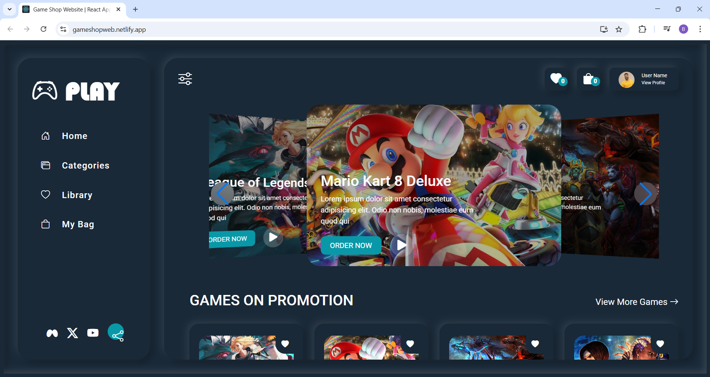

# 🎮 Game Shop Website

Website toko game modern yang dibangun dengan React. Menampilkan katalog game dengan fitur slider interaktif, rating, dan promo diskon.

## 📸 Preview



Website ini menampilkan:
- Slider game interaktif dengan efek coverflow
- Kartu game dengan informasi harga dan diskon
- Side menu navigasi
- Trailer video game

## 🛠️ Tech Stack

- **React** v19.2.3
- **Bootstrap** v5.3.8
- **Bootstrap Icons** v1.13.1
- **Swiper** v12.0.3 (untuk slider)
- **Create React App**

## 📁 Struktur Project

```
src/
├── components/
│   ├── GameCard.jsx      # Komponen kartu game
│   ├── GameRating.jsx    # Komponen rating bintang
│   ├── GameSlide.jsx     # Komponen slide individual
│   ├── GameSwiper.jsx    # Komponen slider utama
│   ├── NavListItem.jsx   # Item navigasi
│   └── SideMenu.jsx      # Menu samping
├── pages/
│   ├── Header.jsx        # Header dengan search bar
│   ├── Home.jsx          # Halaman utama
│   └── Main.jsx          # Layout utama
├── data/
│   └── navListData.js    # Data navigasi
└── App.js                # Entry point
```

## 🚀 Cara Menjalankan

### Prasyarat
- Node.js (v16 atau lebih baru)
- npm atau yarn

### Instalasi

```bash
# Clone repository
git clone https://github.com/USERNAME/game-shop-website.git

# Masuk ke direktori project
cd game-shop-website

# Install dependencies
npm install
```

### Menjalankan Development Server

```bash
npm start
```

Buka [http://localhost:3000](http://localhost:3000) di browser.

### Build untuk Production

```bash
npm run build
```

Hasil build akan tersedia di folder `build/`.

## 🎯 Fitur

- ✅ Responsive design dengan Bootstrap
- ✅ Slider game dengan efek coverflow (Swiper.js)
- ✅ Sistem rating game
- ✅ Tampilan harga dengan diskon
- ✅ Side menu navigasi
- ✅ Preview trailer video
- ✅ Kategori game (MOBA, Racing, Fighting, dll)

## 📝 API Data

Data game disimpan di `public/api/gamesData.json` dengan struktur:

```json
{
  "_id": 1,
  "title": "League of Legends",
  "description": "...",
  "level": "Median",
  "category": "MOBA",
  "rating": 3,
  "discount": 0.5,
  "price": 79.0,
  "img": "./assets/games/lol-bg.jpeg",
  "trailer": "https://youtube.com/embed/...",
  "active": true
}
```

## 🌐 Deployment

Project ini dapat di-deploy ke Netlify:

1. Push ke GitHub
2. Connect repository di Netlify
3. Build command: `npm run build`
4. Publish directory: `build`

## 📄 License

MIT License
